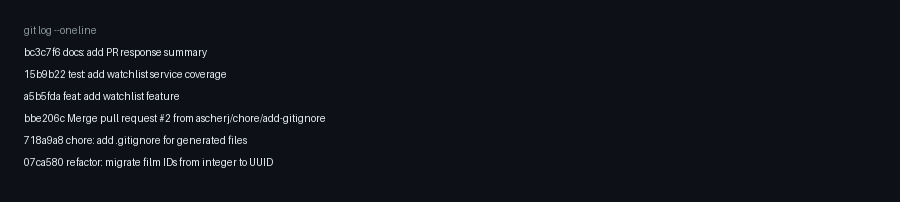

# CineLog PR Response

## AI Usage

I used AI to help orient myself in the codebase, summarize the expected service/test patterns, and plan the order for addressing review comments. I checked AI suggestions against the local project files before making decisions.

## Codebase Orientation

The project separates route handlers from service logic. Routes live under `routes/` and handle HTTP request/response behavior. Service files under `services/` contain the business logic and database operations.

The existing collection feature is the main reference pattern for the watchlist feature:

- `add_to_collection()` uses the `verb_to_noun` naming convention.
- `add_to_collection()` checks that the film exists before creating an entry.
- `add_to_collection()` checks for an existing user/film pair before inserting a duplicate.
- `tests/test_collection.py` uses fixtures for an isolated app, sample user, and sample film.
- `test_add_to_collection_nonexistent_film_raises()` is the pattern for the required watchlist nonexistent-film test.

The `feature/watchlist` branch currently adds a `WatchlistEntry` model, a watchlist service, and watchlist routes. The branch still uses integer film IDs in the watchlist code, while `main` has moved film IDs to UUIDs, so the rebase step is expected to need careful conflict resolution.

## Comment Response Plan

I will address the six review comments in this order:

1. Rename `save_to_watchlist()` to `add_to_watchlist()` so the watchlist service follows the same naming convention as `add_to_collection()`.
2. Add deduplication to `add_to_watchlist()` so the same user cannot save the same film to the watchlist more than once.
3. Add a watchlist test for the nonexistent-film case, modeled after the collection service test.
4. Document the design decision for the `public=True` default.
5. Document the design decision for watchlist sort order.
6. Rebase `feature/watchlist` onto `main` and resolve the UUID-related conflict.

## Comment 1 - Rename

Renamed `save_to_watchlist()` to `add_to_watchlist()` in `services/watchlist_service.py` so the watchlist service follows the same `verb_to_noun` convention used by `add_to_collection()`.

I also updated the route import and call in `routes/watchlist/watchlist.py`, then searched for the old function name to confirm no references remained.

Verification:

- `python -m pytest tests/ -v`

## Comment 2 - Deduplication

Added duplicate protection to `add_to_watchlist()`. The function now checks for an existing `WatchlistEntry` with the same `user_id` and `film_id` before creating a new entry.

If a duplicate exists, it raises `AlreadyInWatchlistError` instead of inserting another row. This matches the existing deduplication pattern in `add_to_collection()`.

Verification:

- `python -m pytest tests/ -v`

## Comment 3 - Missing Test

Added `tests/test_watchlist.py` with coverage for the watchlist service.

The new tests cover:

- adding a valid film to the watchlist
- preventing duplicate watchlist entries
- raising `FilmNotFoundError` when the film does not exist

The nonexistent-film test is modeled after `test_add_to_collection_nonexistent_film_raises()` in `tests/test_collection.py`.

Verification:

- `python -m pytest tests/test_watchlist.py -v`
- `python -m pytest tests/ -v`

## Comment 4 - Default Visibility

I kept the `public=True` default for watchlist entries.

CineLog is centered on film discovery, so public watchlist entries support the product goal of helping users see what other people are interested in watching. That can lead to recommendations, conversation, and shared discovery around films.

The tradeoff is privacy. Some users may not want their saved films visible by default, so a future improvement could make the default visibility configurable in user settings or make the visibility choice clearer in the UI before saving.

## Comment 5 - Sort Order

Changed the watchlist sort order to newest-first by `WatchlistEntry.date_added.desc()`.

A watchlist represents films the user recently saved for later, so the newest additions are usually the most relevant to show first. This also matches the collection behavior, where recently added films appear before older entries.

Verification:

- `python -m pytest tests/ -v`

## Comment 6 - Rebase

Rebased `feature/watchlist` onto `origin/main`, which includes the film ID migration from integer IDs to UUID strings.

The rebase itself completed without a manual merge conflict, but verification exposed the important UUID integration issue: the watchlist feature needed `WatchlistEntry` restored on top of the post-refactor `models.py`. I restored `WatchlistEntry` with `film_id = db.Column(db.String(36), db.ForeignKey("film.id"), nullable=False)` so it matches the UUID-based `Film.id` on `main`.

I also updated stale watchlist comments/tests that still described `film_id` as an integer. The nonexistent-film watchlist test now uses a fake UUID string instead of an integer.

Verification:

- `git rebase origin/main`
- `python -m pytest tests/ -v`

## PR Description

This PR adds a watchlist feature to CineLog so users can save films they want to watch later. It adds a `WatchlistEntry` model, watchlist service logic, and `/watchlist` routes for adding films and viewing a user's saved films.

Design decisions:

- Watchlist entries are public by default because CineLog is centered on film discovery and shared recommendations.
- Watchlists are sorted newest-first so recently saved films appear before older entries.
- Duplicate user/film watchlist entries are rejected with `AlreadyInWatchlistError`, matching the collection service pattern.
- The branch was rebased onto the UUID-based `main`, so watchlist `film_id` values now use UUID strings.

Testing:

- `python -m pytest tests/test_watchlist.py -v`
- `python -m pytest tests/ -v`

## Git Log Screenshot

